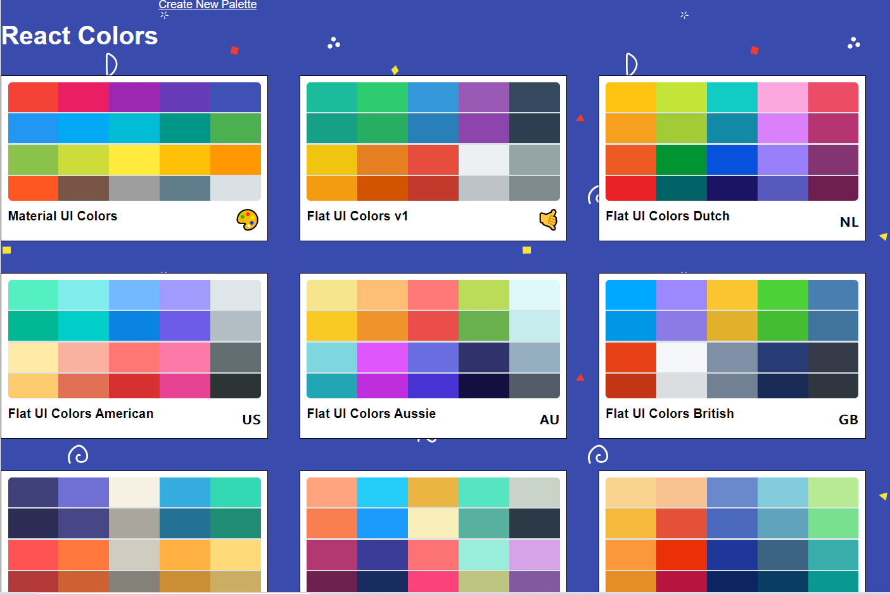
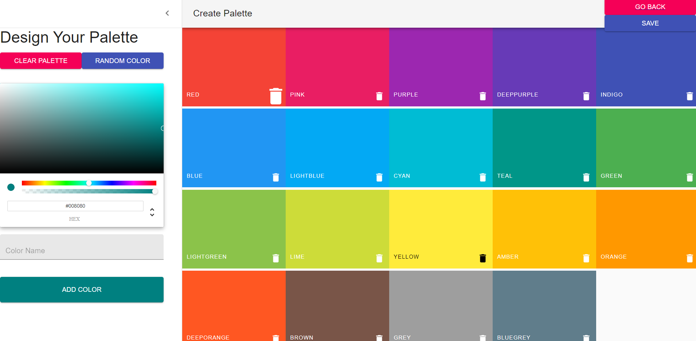
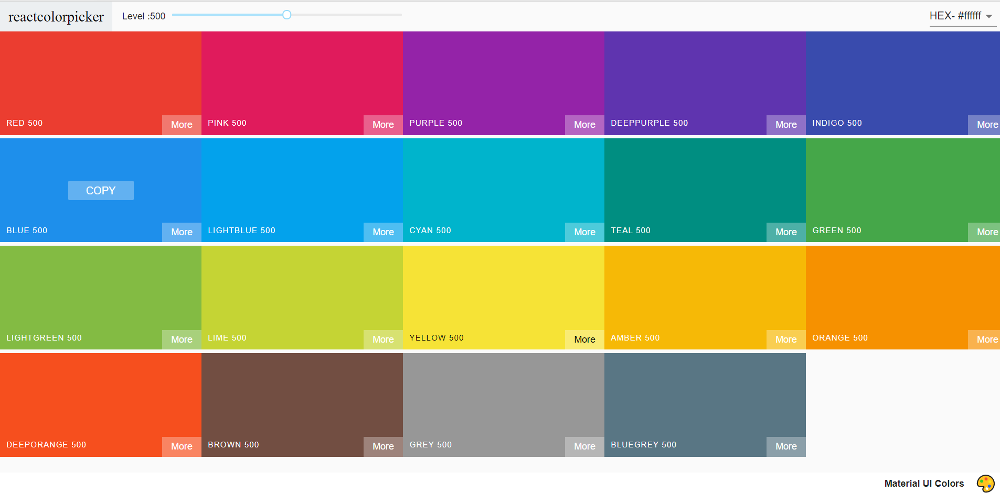
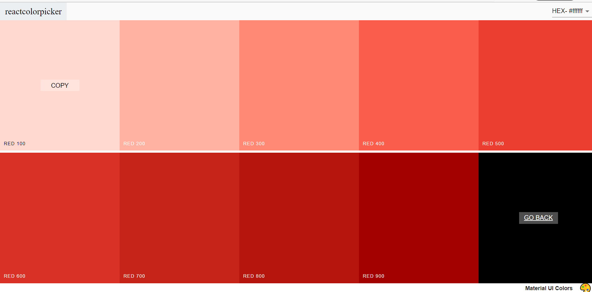
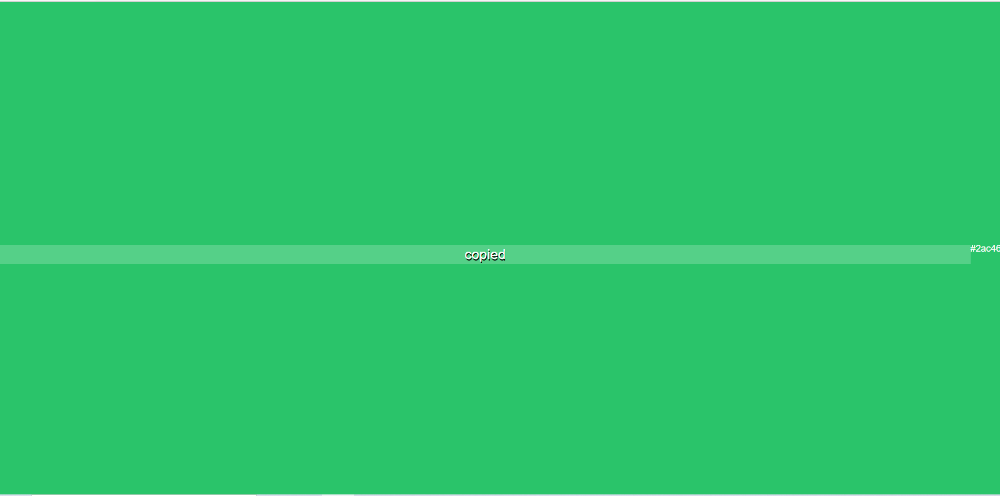

# React Color App

This is a website to  create palette,view your saved color palette,view the colors from it's lighest to darkest range

This Project is a Clone of [FLatUIColors](https://github.com/Colt/react-colors)

## Home Page

## Create Palette

## View Palette

## View Individual Color
 

## Copy Color

